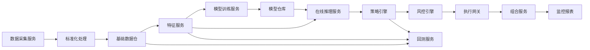
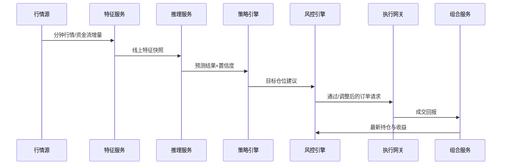

# AI量化交易系统详细设计

## 1. 文档目的

本文档在概要设计基础上，细化系统的服务拆分、数据模型、接口契约、核心算法流程、任务调度和异常处理方案，作为研发实施的直接依据。

## 2. 设计假设

1. 首期交易标的仅限科创板与创业板股票及相关指数、行业板块。
2. 首期以日频训练、分钟级推理和分钟级交易为主。
3. 首期支持单账户或少量账户，不追求撮合级超低延迟。
4. 首期优先采用 Python 技术栈，兼顾研究效率和工程实现速度。
5. 外部交易通过券商 API 或模拟交易网关接入。

## 3. 逻辑架构



## 4. 运行组件设计

### 4.1 数据采集服务 `data_collector`

职责：

1. 从 TuShare、新闻源、公告源、券商源拉取数据。
2. 按数据源执行增量采集、重试、去重和校验。
3. 将结果写入 `raw_*` 表或 Parquet 分区。

核心子任务：

1. `sync_daily_bars`
2. `sync_minute_bars`
3. `sync_financial_reports`
4. `sync_news_articles`
5. `sync_board_capital_flow`
6. `sync_trading_calendar`

异常策略：

1. 单源失败重试 3 次。
2. 连续失败超过阈值后发送告警并标记数据新鲜度下降。
3. 关键交易时段不覆盖旧数据，只追加新版本。

### 4.2 标准化与特征服务 `feature_engine`

职责：

1. 将原始数据转换为统一证券编码、统一时区、统一字段标准。
2. 生成训练和线上共享特征。
3. 输出特征快照，保证回测与实盘一致。

特征分类：

1. 技术因子：收益率、波动率、均线偏离、量比、换手率、涨跌停距离。
2. 基本面因子：营收增速、净利润增速、研发费用率、毛利率、PE/PB 分位。
3. 市场因子：板块资金流、相对强弱、指数联动、涨跌家数。
4. 情绪因子：公告情绪分、新闻情绪分、研报情绪分、情绪变化率。
5. 约束因子：流动性、停牌状态、ST 风险、上市天数、波动异常标签。

输出：

1. `factor_value`
2. `feature_snapshot`
3. `training_sample`
4. `inference_feature_view`

### 4.3 模型训练服务 `model_training`

职责：

1. 按计划训练趋势模型、资金流模型和情绪模型。
2. 统一管理数据切片、训练配置、指标评估和模型注册。
3. 产出可部署模型和评估报告。

模型设计：

1. 趋势模型：基于多时间窗序列特征的 Transformer 或 LSTM。
2. 资金流模型：基于横截面因子的 LightGBM 或 XGBoost。
3. 情绪模型：基于中文金融 BERT 的文本分类或回归模型。
4. 融合模型：将子模型输出和关键因子送入二层集成器，输出综合评分。

关键约束：

1. 训练样本必须避免未来函数泄露。
2. 训练、验证、测试按时间切分。
3. 线上只允许加载通过验证阈值的模型版本。

### 4.4 在线推理服务 `inference_service`

职责：

1. 加载线上模型版本。
2. 接收分钟级或批量特征快照并生成预测。
3. 输出预测值、置信度和模型版本。

推理输出字段：

1. `symbol`
2. `trade_time`
3. `pred_return_1d`
4. `pred_up_prob`
5. `pred_capital_flow`
6. `sentiment_score`
7. `confidence_score`
8. `model_version`

### 4.5 策略引擎 `strategy_engine`

职责：

1. 将预测结果转为交易信号。
2. 完成选股、排序、打分、仓位分配和调仓建议。
3. 支持多策略并行和策略组合。

建议的基线策略：

1. 候选池过滤：剔除停牌、涨跌停封死、流动性不足、风险名单标的。
2. 评分计算：综合趋势分、资金流分、情绪分和估值约束分。
3. 排名选股：取 Top N 做多候选。
4. 仓位计算：基于总风险预算、置信度和个股风险暴露生成目标仓位。
5. 调仓判断：只有当目标仓位变化超过阈值时才发起交易，降低噪声换手。

示例评分公式：

```text
total_score =
  0.40 * trend_score +
  0.25 * capital_flow_score +
  0.20 * sentiment_score +
  0.15 * fundamental_score
```

示例目标仓位公式：

```text
target_weight =
  min(max_single_weight, total_score_norm * confidence_score * market_risk_factor)
```

### 4.6 风控引擎 `risk_engine`

职责：

1. 对策略信号执行交易前检查。
2. 对持仓执行盘中、日内、日终风险检查。
3. 产出阻断、降仓、告警和强平建议。

核心规则：

1. 单股仓位上限，例如不超过总资产的 10%。
2. 单板块仓位上限，例如不超过总资产的 30%。
3. 单日换手率上限，控制交易成本。
4. 组合最大回撤阈值，触发减仓或停止开仓。
5. 低置信度信号自动衰减仓位。
6. 波动和流动性异常时禁止新开仓。
7. 黑天鹅关键词、重大负面公告出现时立即标记风险事件。

风控决策结果：

1. `ALLOW`
2. `ADJUST`
3. `REJECT`
4. `FORCE_EXIT`

### 4.7 执行网关 `execution_gateway`

职责：

1. 将目标仓位转为订单。
2. 通过券商适配器发单、撤单、查询和重试。
3. 处理成交回报并更新订单状态。

执行流程：

1. 读取当前持仓和目标持仓差异。
2. 生成买卖订单列表。
3. 根据盘口和滑点模型确定委托价格。
4. 发单并记录幂等键。
5. 跟踪成交结果，未成交订单按规则撤改。

订单状态机：

1. `CREATED`
2. `RISK_APPROVED`
3. `SUBMITTED`
4. `PART_FILLED`
5. `FILLED`
6. `CANCELED`
7. `REJECTED`
8. `FAILED`

### 4.8 组合服务 `portfolio_service`

职责：

1. 管理账户、现金、持仓和净值。
2. 计算浮盈、已实现收益、行业暴露和仓位利用率。
3. 提供策略、账户、标的三级视图。

### 4.9 回测服务 `backtest_service`

职责：

1. 用统一策略逻辑对历史数据进行回测。
2. 支持参数扫描、样本外验证和滚动回测。
3. 输出风险收益指标和归因报告。

仿真规则：

1. 撮合以分钟线或日线近似成交。
2. 引入手续费、滑点、印花税、最小成交量约束。
3. 对涨跌停、停牌、流动性不足做成交限制。

### 4.10 报表与告警服务 `reporting_service`

职责：

1. 生成回测报告、交易日报、风险日报和模型效果报告。
2. 通过邮件、企业微信或钉钉发送告警。
3. 提供 Web 看板的数据接口。

## 5. 物理存储设计

## 5.1 存储选型

1. `PostgreSQL`：事务型数据、元数据、配置、订单、持仓、风险事件。
2. `Parquet`：历史行情、新闻文本、特征快照、训练样本。
3. `Redis`：热点缓存、实时状态、幂等控制、轻量任务队列。

## 5.2 核心表设计

### 5.2.1 证券主数据表 `security_master`

| 字段 | 类型 | 说明 |
| --- | --- | --- |
| id | bigint | 主键 |
| symbol | varchar(16) | 股票代码 |
| exchange | varchar(8) | 交易所 |
| board | varchar(16) | `STAR` 或 `GEM` |
| name | varchar(64) | 股票名称 |
| list_date | date | 上市日期 |
| status | varchar(16) | 上市、停牌、退市 |
| industry_code | varchar(32) | 行业编码 |
| is_risk_flag | boolean | 风险标记 |
| updated_at | timestamp | 更新时间 |

### 5.2.2 日线行情表 `market_bar_1d`

| 字段 | 类型 | 说明 |
| --- | --- | --- |
| symbol | varchar(16) | 股票代码 |
| trade_date | date | 交易日 |
| open | numeric(18,4) | 开盘价 |
| high | numeric(18,4) | 最高价 |
| low | numeric(18,4) | 最低价 |
| close | numeric(18,4) | 收盘价 |
| volume | numeric(20,2) | 成交量 |
| amount | numeric(20,2) | 成交额 |
| turnover_rate | numeric(10,4) | 换手率 |
| source | varchar(32) | 数据源 |
| ingest_time | timestamp | 入库时间 |

主键建议：`(symbol, trade_date)`

### 5.2.3 分钟行情表 `market_bar_1m`

| 字段 | 类型 | 说明 |
| --- | --- | --- |
| symbol | varchar(16) | 股票代码 |
| trade_time | timestamp | 分钟时间 |
| open | numeric(18,4) | 开盘价 |
| high | numeric(18,4) | 最高价 |
| low | numeric(18,4) | 最低价 |
| close | numeric(18,4) | 收盘价 |
| volume | numeric(20,2) | 成交量 |
| amount | numeric(20,2) | 成交额 |
| avg_price | numeric(18,4) | 均价 |

主键建议：`(symbol, trade_time)`

### 5.2.4 财务指标表 `financial_indicator`

| 字段 | 类型 | 说明 |
| --- | --- | --- |
| symbol | varchar(16) | 股票代码 |
| report_period | date | 报告期 |
| revenue | numeric(20,2) | 营收 |
| net_profit | numeric(20,2) | 净利润 |
| gross_margin | numeric(10,4) | 毛利率 |
| rd_expense_ratio | numeric(10,4) | 研发费用率 |
| roe | numeric(10,4) | ROE |
| pe_ttm | numeric(12,4) | PE |
| pb | numeric(12,4) | PB |
| publish_date | date | 公告日期 |

### 5.2.5 新闻舆情表 `news_article`

| 字段 | 类型 | 说明 |
| --- | --- | --- |
| id | bigint | 主键 |
| symbol | varchar(16) | 关联标的，可为空 |
| source | varchar(64) | 新闻源 |
| title | varchar(256) | 标题 |
| content | text | 正文 |
| published_at | timestamp | 发布时间 |
| sentiment_score | numeric(10,4) | 情绪分 |
| sentiment_label | varchar(16) | 正面、中性、负面 |
| hash_key | varchar(64) | 去重键 |

### 5.2.6 因子值表 `factor_value`

| 字段 | 类型 | 说明 |
| --- | --- | --- |
| symbol | varchar(16) | 股票代码 |
| as_of_time | timestamp | 因子时点 |
| factor_name | varchar(64) | 因子名 |
| factor_value | numeric(20,8) | 因子值 |
| factor_group | varchar(32) | 技术、基本面、情绪、市场 |
| version | varchar(32) | 因子版本 |

主键建议：`(symbol, as_of_time, factor_name, version)`

### 5.2.7 模型运行表 `model_run`

| 字段 | 类型 | 说明 |
| --- | --- | --- |
| run_id | varchar(64) | 训练或推理批次号 |
| model_name | varchar(64) | 模型名 |
| model_version | varchar(64) | 版本 |
| run_type | varchar(16) | train、validate、infer |
| start_time | timestamp | 开始时间 |
| end_time | timestamp | 结束时间 |
| status | varchar(16) | 成功、失败、取消 |
| metrics_json | jsonb | 指标 |
| artifact_uri | varchar(256) | 模型路径 |

### 5.2.8 预测信号表 `prediction_signal`

| 字段 | 类型 | 说明 |
| --- | --- | --- |
| signal_id | bigint | 主键 |
| symbol | varchar(16) | 股票代码 |
| trade_time | timestamp | 产生时间 |
| strategy_name | varchar(64) | 策略名 |
| model_version | varchar(64) | 模型版本 |
| pred_return | numeric(12,6) | 预测收益 |
| up_prob | numeric(10,6) | 上涨概率 |
| confidence_score | numeric(10,6) | 置信度 |
| signal_action | varchar(16) | BUY、SELL、HOLD |
| target_weight | numeric(10,6) | 目标仓位 |
| reason_json | jsonb | 解释信息 |

### 5.2.9 订单表 `trade_order`

| 字段 | 类型 | 说明 |
| --- | --- | --- |
| order_id | varchar(64) | 订单号 |
| broker_order_id | varchar(64) | 券商订单号 |
| account_id | varchar(64) | 账户 |
| symbol | varchar(16) | 股票代码 |
| side | varchar(8) | BUY 或 SELL |
| order_type | varchar(16) | LIMIT、MARKET |
| price | numeric(18,4) | 委托价 |
| quantity | integer | 委托量 |
| filled_quantity | integer | 成交量 |
| status | varchar(16) | 订单状态 |
| source_signal_id | bigint | 来源信号 |
| idempotency_key | varchar(64) | 幂等键 |
| created_at | timestamp | 创建时间 |
| updated_at | timestamp | 更新时间 |

### 5.2.10 持仓表 `portfolio_position`

| 字段 | 类型 | 说明 |
| --- | --- | --- |
| account_id | varchar(64) | 账户 |
| symbol | varchar(16) | 股票代码 |
| quantity | integer | 持仓量 |
| available_quantity | integer | 可卖量 |
| avg_cost | numeric(18,4) | 持仓成本 |
| market_value | numeric(20,2) | 市值 |
| unrealized_pnl | numeric(20,2) | 浮盈亏 |
| updated_at | timestamp | 更新时间 |

主键建议：`(account_id, symbol)`

### 5.2.11 风险事件表 `risk_event`

| 字段 | 类型 | 说明 |
| --- | --- | --- |
| event_id | bigint | 主键 |
| event_time | timestamp | 事件时间 |
| event_type | varchar(32) | 回撤、波动、舆情、流动性 |
| severity | varchar(16) | INFO、WARN、CRITICAL |
| symbol | varchar(16) | 标的，可为空 |
| account_id | varchar(64) | 账户，可为空 |
| action | varchar(16) | 告警、阻断、减仓、平仓 |
| detail_json | jsonb | 详情 |

## 6. 接口设计

## 6.1 内部服务接口

### 6.1.1 触发训练

`POST /api/v1/models/train`

请求示例：

```json
{
  "model_name": "trend_transformer",
  "dataset_version": "2026-05-01",
  "train_range": ["2022-01-01", "2025-12-31"],
  "hyper_params": {
    "lookback": 60,
    "epochs": 30,
    "batch_size": 128
  }
}
```

响应示例：

```json
{
  "run_id": "train_20260509_001",
  "status": "accepted"
}
```

### 6.1.2 在线推理

`POST /api/v1/inference/predict`

请求示例：

```json
{
  "trade_time": "2026-05-09T10:15:00+08:00",
  "symbols": ["688001", "300750"],
  "feature_version": "v1.0.0"
}
```

响应示例：

```json
{
  "results": [
    {
      "symbol": "688001",
      "pred_return_1d": 0.021,
      "up_prob": 0.67,
      "confidence_score": 0.72,
      "model_version": "ensemble_20260508"
    }
  ]
}
```

### 6.1.3 生成目标仓位

`POST /api/v1/strategy/rebalance`

请求示例：

```json
{
  "account_id": "sim_a001",
  "strategy_name": "growth_rotation_v1",
  "trade_time": "2026-05-09T10:16:00+08:00"
}
```

响应示例：

```json
{
  "rebalance_id": "rb_20260509_101600",
  "target_positions": [
    {
      "symbol": "300750",
      "target_weight": 0.08
    }
  ]
}
```

### 6.1.4 提交订单

`POST /api/v1/orders/submit`

请求示例：

```json
{
  "account_id": "sim_a001",
  "orders": [
    {
      "symbol": "300750",
      "side": "BUY",
      "price": 182.35,
      "quantity": 500,
      "source_signal_id": 102341
    }
  ]
}
```

### 6.1.5 查询风险状态

`GET /api/v1/risk/status?account_id=sim_a001`

响应示例：

```json
{
  "account_id": "sim_a001",
  "drawdown": 0.042,
  "risk_level": "NORMAL",
  "open_position_allowed": true
}
```

## 6.2 券商适配器接口

抽象接口定义：

1. `place_order(order)`
2. `cancel_order(order_id)`
3. `query_order(order_id)`
4. `query_positions(account_id)`
5. `query_balance(account_id)`
6. `fetch_fills(start_time, end_time)`

设计要求：

1. 统一返回码和错误语义。
2. 适配器内部完成签名、重试和节流。
3. 所有外部调用都必须落审计日志。

## 7. 调度设计

## 7.1 定时任务

| 任务 | 触发时机 | 说明 |
| --- | --- | --- |
| 日线数据同步 | 每个交易日收盘后 | 更新日线、资金流、公告、新闻 |
| 财务数据同步 | 每日夜间 | 更新财务指标和估值指标 |
| 特征生成 | 夜间和盘中 | 生成离线样本和线上快照 |
| 模型训练 | 每周或每月 | 重训模型并生成报告 |
| 盘前准备 | 开盘前 30 分钟 | 加载配置、刷新股票池 |
| 盘中推理 | 每分钟或事件触发 | 生成预测与信号 |
| 风控检查 | 每分钟 | 检查回撤、波动和异常 |
| 交易日报 | 收盘后 | 生成收益和执行报告 |

## 7.2 事件驱动

建议使用以下事件主题：

1. `market.minute_bar.arrived`
2. `feature.snapshot.ready`
3. `prediction.generated`
4. `signal.generated`
5. `risk.decision.made`
6. `order.submitted`
7. `order.filled`
8. `risk.event.triggered`

## 8. 核心流程详细说明

## 8.1 盘中推理到交易闭环



步骤说明：

1. 特征服务从最新行情和缓存中增量计算分钟级特征。
2. 推理服务批量生成预测，避免逐股调用。
3. 策略引擎执行过滤、评分和目标仓位计算。
4. 风控引擎对仓位上限、回撤、流动性、异常公告进行检查。
5. 执行网关生成订单并跟踪成交。
6. 组合服务回写持仓和净值。

## 8.2 回测流程

1. 固定交易日历、股票池、手续费和滑点模型。
2. 按时间推进历史行情。
3. 在每个决策点复用实盘同一套特征、信号、风控和下单逻辑。
4. 记录订单、成交、持仓和净值曲线。
5. 生成绩效、归因和敏感性分析报告。

## 9. 模型治理设计

1. 每个模型必须具备 `model_name + version + dataset_version + feature_version` 四元标识。
2. 模型上线前必须经过样本外评估和回测验证。
3. 模型表现低于阈值时自动降级到上一稳定版本。
4. 所有推理结果都要记录模型版本，支持交易后归因。

建议评估指标：

1. 分类任务：AUC、F1、Precision、Recall。
2. 回归任务：IC、RankIC、MAE、RMSE。
3. 策略级指标：年化收益、最大回撤、夏普比率、Calmar、换手率。

## 10. 风控详细规则

### 10.1 交易前风控

1. 股票不在允许池内时拒绝交易。
2. 预计成交额占分钟成交额比例过高时拒绝交易。
3. 个股仓位超限时自动缩单。
4. 账户现金不足时拒绝买单。

### 10.2 盘中风控

1. 组合回撤超过一级阈值时停止开仓。
2. 组合回撤超过二级阈值时强制降仓。
3. 标的瞬时波动超过阈值且伴随负面新闻时触发风控事件。
4. 多次下单失败时切换人工接管模式。

### 10.3 日终风控

1. 复核持仓与券商侧是否一致。
2. 复核成交与账务是否一致。
3. 输出风险日报并归档。

## 11. 日志与监控设计

日志分类：

1. `business_log`：信号、订单、持仓、风控决策。
2. `system_log`：任务执行、异常栈、依赖调用。
3. `audit_log`：模型切换、参数修改、人工干预、审批记录。

关键监控指标：

1. 数据新鲜度延迟。
2. 推理延迟和成功率。
3. 发单成功率、成交率、撤单率。
4. 组合净值、回撤、仓位利用率。
5. 模型命中率、IC 和策略收益偏离。

告警等级：

1. `INFO`：一般运行提示。
2. `WARN`：需要关注但不阻断交易。
3. `CRITICAL`：立即通知并可触发自动风控。

## 12. 安全设计

1. 券商账号、API Key 和数据库密码必须使用密钥管理服务或加密配置。
2. 管理端接口需做身份认证和权限控制。
3. 交易、风控、模型发布操作都必须有审计记录。
4. 关键配置变更必须支持双人复核或审批流程。

## 13. 容错与恢复设计

1. 所有定时任务必须支持断点续跑。
2. 订单提交使用幂等键避免重复下单。
3. 外部接口失败时按退避策略重试。
4. Redis 或任务队列故障时，盘中系统退化为只读监控和人工下单模式。
5. 收盘后执行持仓、订单、现金三方对账，发现不一致时进入锁定状态。

## 14. 首期实施建议

建议分三步落地：

1. 第一步：完成数据接入、存储、特征、回测和报表，先跑通研究闭环。
2. 第二步：完成在线推理、策略引擎、风控引擎和模拟交易。
3. 第三步：接入真实券商 API、实盘监控和告警闭环。

首期最小可用子集：

1. 日线与分钟线行情。
2. 基础财务指标。
3. 技术因子和简化情绪因子。
4. 单模型趋势预测。
5. 单账户模拟交易。
6. 基础仓位风控和回撤风控。
