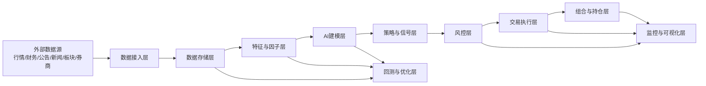
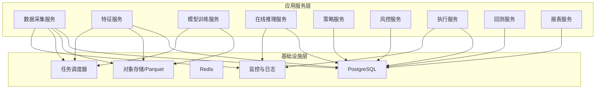

# AI量化交易系统概要设计

## 1. 文档目的

本文档基于 [product.md](./product.md) 的产品需求，给出 AI 驱动的科创板与创业板量化交易系统的概要设计，用于统一系统边界、核心架构、模块拆分、关键流程和非功能要求。

## 2. 设计范围

系统覆盖以下业务能力：

1. 行情、财务、舆情、板块与资金流数据接入。
2. 因子加工、AI 模型训练、推理和信号生成。
3. 历史回测、参数优化和策略评估。
4. 自动交易执行、仓位控制和异常处理。
5. 风险控制、监控告警、可视化报表和审计追踪。

不在本期范围内的内容：

1. 跨市场扩展到主板、港股、美股。
2. 高频撮合级低延迟交易。
3. 完整券商柜台适配的商用认证实施细节。

## 3. 设计目标

## 3.1 业务目标

1. 提升科创板、创业板选股和择时能力。
2. 建立可追溯、可回测、可监控的自动交易闭环。
3. 在收益追求之外优先保证风险可控和合规可审计。

## 3.2 技术目标

1. 模块化架构，支持策略和模型独立演进。
2. 数据、训练、推理、执行链路解耦，便于扩展。
3. 同时支持离线研究和在线交易。
4. 提供高可观测性，支持问题回溯和绩效分析。

## 4. 总体架构

系统采用“分层架构 + 事件驱动编排”的设计。离线场景以批处理为主，在线场景以准实时推理、风控和执行为主。

## 5. 分层说明

### 5.1 数据接入层

职责：

1. 接入 TuShare、券商接口、公告源、新闻源等外部数据。
2. 完成数据抽取、格式归一、去重和基础校验。
3. 将原始数据写入原始数据区，并触发后续清洗任务。

### 5.2 数据存储层

职责：

1. 存储标准化后的行情、财务、舆情、因子、模型结果和交易数据。
2. 同时满足研究分析、在线查询、审计留痕三类需求。
3. 区分原始数据、标准数据、特征数据和结果数据。

建议存储分层：

1. `Raw`：原始抓取数据，保留源字段。
2. `ODS`：标准化后的结构化数据。
3. `Feature`：因子、特征、标签。
4. `Serve`：信号、订单、持仓、风控事件和报表。

### 5.3 特征与因子层

职责：

1. 生成技术因子、基本面因子、市场因子、情绪因子。
2. 维护训练集、验证集和线上特征的一致性。
3. 输出可复用的特征视图供训练、回测和推理共享。

### 5.4 AI建模层

职责：

1. 训练趋势预测、资金流预测、舆情情绪模型。
2. 输出统一格式的预测结果和置信度。
3. 支持模型版本管理、回滚和迁移学习。

### 5.5 策略与信号层

职责：

1. 汇聚多模型输出与多因子结果。
2. 形成买入、卖出、观望信号和目标仓位建议。
3. 对不同市场风格、板块轮动场景应用不同策略模板。

### 5.6 风控层

职责：

1. 对信号进行交易前风险拦截。
2. 对执行中的仓位、回撤、集中度和异常波动进行实时控制。
3. 对置信度不足、流动性不足、黑名单标的自动降权或阻断。

### 5.7 交易执行层

职责：

1. 将目标仓位转换为订单请求。
2. 通过券商 API 发单、撤单、重试和状态跟踪。
3. 回写成交、持仓、现金和执行偏差。

### 5.8 回测与优化层

职责：

1. 使用统一的特征和信号逻辑进行历史回测。
2. 模拟手续费、滑点、涨跌停和流动性约束。
3. 输出收益、回撤、波动率、胜率和因子贡献分析。

### 5.9 监控与可视化层

职责：

1. 展示行情、信号、订单、持仓、资金曲线和回撤。
2. 监控任务状态、模型效果、执行异常和系统健康度。
3. 向交易员、风控经理和管理者输出角色化视图。

## 6. 核心模块划分

| 模块 | 主要职责 | 主要输入 | 主要输出 |
| --- | --- | --- | --- |
| Data Collector | 外部数据采集与落库 | 行情/财务/新闻/公告/API | 原始数据、标准数据 |
| Feature Engine | 因子与特征加工 | 标准数据 | 特征表、标签表 |
| Model Center | 训练、评估、版本管理 | 特征表、标签表 | 模型产物、预测结果 |
| Strategy Engine | 信号融合与仓位建议 | 预测结果、因子、组合状态 | 交易信号、目标仓位 |
| Risk Engine | 交易前后风控 | 信号、订单、持仓、行情 | 风控决策、风险事件 |
| Execution Gateway | 下单与成交回报 | 目标订单、券商状态 | 订单状态、成交记录 |
| Portfolio Service | 账户、持仓、收益计算 | 成交、行情、资金 | 持仓、净值、绩效 |
| Backtest Service | 历史仿真与参数优化 | 历史数据、策略配置 | 回测结果、优化结果 |
| Monitoring Center | 告警、报表、看板 | 全链路日志与指标 | 仪表盘、告警通知 |

## 7. 关键业务流程

### 7.1 离线训练流程

1. 定时采集并清洗历史行情、财务和舆情数据。
2. 生成因子、标签和训练样本。
3. 训练多个子模型并评估。
4. 将通过阈值的模型注册为候选线上版本。
5. 产出模型报告并通知人工确认或自动切换。

### 7.2 盘前准备流程

1. 更新上日收盘数据、公告和财务数据。
2. 刷新股票池、黑名单、停牌列表和风险参数。
3. 加载最新已发布模型和策略参数。
4. 计算盘前初始目标池和观测名单。

### 7.3 盘中推理与交易流程

1. 接收分钟级行情、资金流和舆情增量。
2. 实时计算线上特征并触发推理。
3. 策略引擎生成信号与目标仓位。
4. 风控引擎执行前置校验。
5. 执行网关下单并跟踪成交。
6. 组合服务更新持仓和收益。
7. 监控中心展示状态并触发告警。

### 7.4 回测与优化流程

1. 选择时间区间、股票池、策略版本和成本模型。
2. 执行回测并记录订单、成交、持仓变化。
3. 汇总收益指标、风险指标、风格暴露和归因。
4. 对参数进行网格搜索或贝叶斯优化。
5. 将表现最优的策略参数登记为候选版本。

## 8. 部署架构

首期建议采用单集群、分服务部署，兼顾工程复杂度与扩展性。

基础设施建议：

1. `PostgreSQL`：存储交易、元数据、配置和中小规模结构化数据。
2. `Parquet/Object Storage`：存储海量历史行情、新闻和特征快照。
3. `Redis`：缓存热点数据、任务状态、幂等键和实时队列。
4. `Scheduler`：统一管理定时任务和批处理流水线。
5. `Prometheus + Grafana + ELK`：指标、日志和告警。

## 9. 非功能设计

### 9.1 性能

1. 分钟级推理链路的端到端延迟目标不超过 5 秒。
2. 订单风控与发单链路目标不超过 1 秒。
3. 历史回测支持至少 3 年分钟级数据的批量运行。

### 9.2 可用性

1. 核心交易时段服务需支持故障重试和断点恢复。
2. 执行服务和风控服务需要幂等设计。
3. 外部数据源异常时应启用降级和缓存兜底。

### 9.3 安全与合规

1. API 密钥、券商凭证和数据库凭证必须加密存储。
2. 全链路保留审计日志，支持按订单、策略、模型版本回溯。
3. 对人工触发交易、策略上线和参数变更保留审批记录。

### 9.4 可维护性

1. 策略逻辑、模型逻辑和执行逻辑解耦。
2. 所有模块使用统一配置中心和版本标识。
3. 关键流程提供模拟环境和可重复回放能力。

## 10. 主要设计决策

1. 采用“离线训练 + 在线推理”模式，而不是盘中训练，降低生产不确定性。
2. 采用多模型集成，而不是单一模型，提升稳健性。
3. 采用“目标仓位驱动执行”，而不是“单信号直接下单”，便于风控和组合优化。
4. 采用统一特征层供回测与实盘共享，避免研究和生产口径不一致。
5. 采用分层存储，平衡查询效率、成本和审计要求。

## 11. 风险与演进建议

当前设计的主要风险：

1. 科创板与创业板个股波动大，模型易受市场风格切换影响。
2. 舆情和公告数据时效性不稳定，可能引入预测偏差。
3. 券商接口稳定性和返回语义差异，会直接影响执行可靠性。

建议的演进路径：

1. 第一阶段先实现日频/分钟级研究、回测和半自动交易。
2. 第二阶段接入实时推理和自动风控闭环。
3. 第三阶段引入更多模型治理、策略组合和多账户支持。
